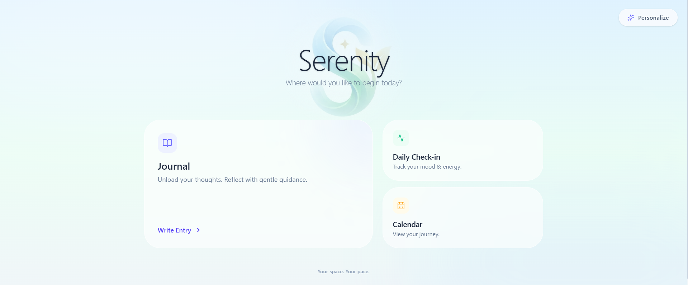


# Serenity 🌿
**Reflect without records. Heal without judgment.**

> 🏆 **Built for PeerBridge Mental Health Hacks 2025**
>
> **Track:** Digital Safe Spaces (Primary) | Tech for Empathy (Secondary)

<div align="center">
  
<div/>

---

## 📖 The Problem
In a digital world that demands your identity, email, and constant connection, mental health apps often feel **clinical** ("Select your symptom") or **intrusive** ("Create an account to continue").

Many youth, especially from diverse cultural backgrounds, hesitate to seek support due to:
* **Stigma:** Fear of a digital paper trail or diagnosis.
* **Cultural Disconnect:** Generic advice that doesn't fit their lived reality.
* **Privacy Concerns:** Unwillingness to share personal data with corporations.

## 💡 The Solution: Serenity
**Serenity is a "Digital Safe Space" designed to be the anti-platform.**
It is an anonymous, culturally-aware journaling web app that helps users feel heard through empathetic AI-powered reflection—without accounts, advice, or diagnosis.

### The "Un-Platform" Philosophy
* 🚫 **No Login:** We don't know who you are, and we don't want to.
* 🚫 **No Advice:** We don't tell you what to do. We help you hear yourself.
* 🚫 **No Permanence:** Your identity exists only in your browser. Clear it, and you're a stranger again.

---

## 🎯 Hackathon Tracks & Impact

### 1. Digital Safe Spaces (Primary Track)
Serenity creates a sanctuary where anonymity is the default. By removing the need for accounts and storing data only via session IDs, we lower the barrier to entry for users who are afraid of stigma or surveillance.

### 2. Tech for Empathy (Secondary Track)
We utilize **Google Gemini 1.5 Flash** not to act as a chatbot, but as a mirror. The AI is prompted specifically to reflect emotions and validate feelings, fostering self-compassion rather than dispensing generic medical advice.

### 🌍 Cultural & Psychological Impact
*(Submission Requirement)*
* **Cultural Sensitivity:** Users can select their "Cultural Tone" (Neutral, Western, Eastern). This allows the AI to frame reflections in a way that aligns with the user's worldview—validating communal values in Eastern contexts or individual autonomy in Western ones.
* **Breaking Stigma:** By removing clinical language ("disorder", "symptoms") and replacing it with human language ("energy", "clarity"), we normalize mental health maintenance as a daily habit, not a medical emergency.
* **Accessibility:** The app is free, requires no signup, and is lightweight, making it accessible to youth in regions with limited data or privacy concerns.

---

## ✨ Key Features

### 1. Anonymous Journaling
Write freely. Our interface is designed to reduce cognitive load—minimal distractions, calming gradients, and a focus on the words. **No personal identifiers are ever collected.**

### 2. Culturally-Aware AI Reflection
Our Gemini-powered engine creates a single-turn reflection based on your text and selected cultural context. It avoids "bot-like" responses and focuses on emotional validation.

### 3. Daily Pulse Check-in
Mental health isn't just "Happy" or "Sad."
* **Granular Tracking:** Log **Physical Energy** (Drained vs. Vibrant) and **Mental Clarity** (Foggy vs. Clear).
* **Visual History:** See your emotional drift over the last 7 days at a glance.

### 4. Crisis Guardrails (Safety First)
Safety is paramount in mental health tech.
* The system actively scans for self-harm or crisis phrases (using Regex & keyword matching) *before* calling the AI.
* If a threat is detected, the AI is bypassed entirely. The user is immediately shown a supportive message with **international helpline resources**, preventing any potential AI hallucinations in sensitive scenarios.

---

## 🏗 Tech Stack

| Component | Technology |
| :--- | :--- |
| **Frontend** | React (Vite), Tailwind CSS, Framer Motion, FullCalendar |
| **Backend** | Node.js, Express.js |
| **Database** | MongoDB Atlas (Mongoose) |
| **AI Engine** | Google Gemini API (gemini-1.5-flash) |
| **Safety** | Custom Regex & Keyword Filtering Middleware |

---

## ⚙️ Setup Instructions

### Prerequisites
* Node.js (v16+)
* MongoDB Atlas Connection String
* Google Gemini API Key

### 1. Clone the Repository
```bash
git clone [https://github.com/yourusername/serenity.git](https://github.com/yourusername/serenity.git)
cd serenity

```

### 2. Backend Setup

```bash
cd server
npm install
# Create a .env file with the variables listed below
node index.js

```

### 3. Frontend Setup

```bash
cd client
npm install
npm run dev

```

### 4. Environment Variables (`server/.env`)

```env
PORT=5000
MONGO_URI=your_mongodb_connection_string
GEMINI_API_KEY=your_gemini_api_key
GEMINI_MODEL=gemini-1.5-flash
CORS_ORIGIN=http://localhost:5173

```

---

## 🔮 Future Scope (Scalability)

To preserve the integrity of our v1 prototype, we focused on core features. Here is our roadmap for the future:

* **Mobile-First App:** Converting the React web app to React Native for better accessibility on low-end devices.
* **End-to-End Encryption:** Encrypting journal entries client-side so even the database admin cannot read them.
* **Peer Communities:** Moderated, anonymous group spaces for users with similar emotional patterns (e.g., "Student Stress", "Grief").

---

## 🏁 Hackathon Compliance Checklist

* ✅ **Timeframe Integrity:** This entire project was conceptualized and built during the PeerBridge hackathon dates (Nov 8 – Dec 22).
* ✅ **AI Disclosure:** We utilize Google Gemini 1.5 Flash for generating reflections.
* ✅ **Safety:** No medical claims are made. Crisis resources are hard-coded.
* ✅ **Accessibility:** The UI is designed with high contrast and readable typography.

---

### 📄 License

Distributed under the MIT License.

> *"Your space. Your pace."*

```
